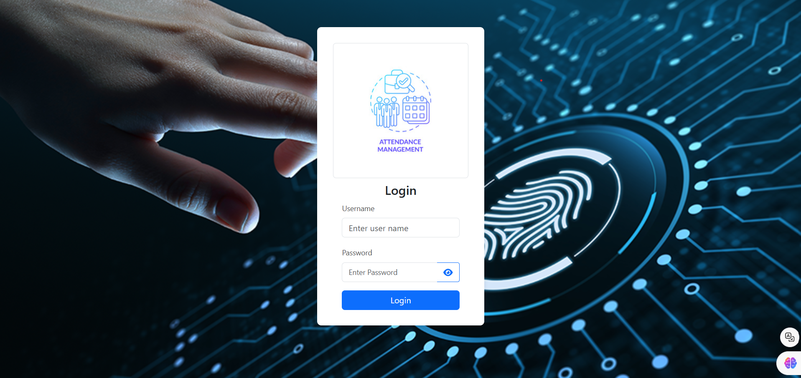
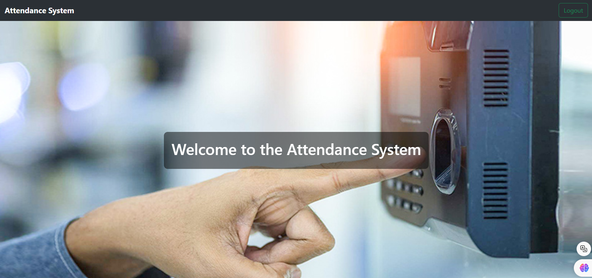
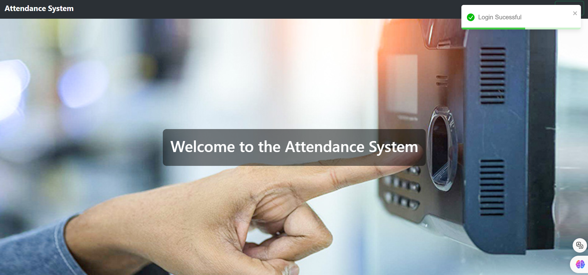
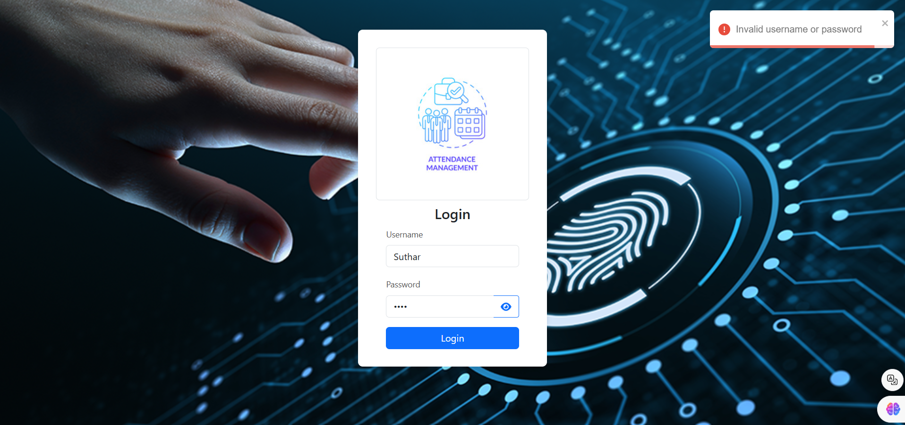

# 3 axixlabs assignment attendance-system
1. Login Page

2. Home Page

3. Sucessful Login

5. Un Sucessful Login



## Built With
[![React][React.js]][React-url]
[![Node.js][Node.js]][Node-url]
[![JWT][JWT]][JWT-url]
[![Bootstrap][Bootstrap-css]][Bootstrap-url]
[![React Toastify][Toastify]][Toastify-url]

* Frontend - Reactjs, React bootstrap
* Backend - Nodejs

## Getting Started 🎉
## Installation
1. Clone the repository
   ```sh
   https://github.com/Suthar98/attendance-system-new.git
   ```
   
2. Install NPM packages
     ```sh
   npm install
   ```
   
3. Create .env file with keys

4. Run the application
    ### Front End
   Open an intergrated terminal in client folder
   ```sh
    npm start
    ```
    ### Backend
   Open an integrated terminal in server folder
   ```sh
    node server.js
    ```
5. ### Login Credentials
 Username - suthar<br>
 Password - 123456


<!-- BUILD WITH URLs -->
[Node.js]: https://img.shields.io/badge/Node.js-339933?style=for-the-badge&logo=nodedotjs&logoColor=white
[Node-url]: https://nodejs.org
[React.js]: https://img.shields.io/badge/React-blue?style=for-the-badge&logo=react&logoColor=white
[React-url]: https://reactjs.org/
[JWT]: https://img.shields.io/badge/JWT-black?style=for-the-badge&logo=JSON%20web%20tokens&logoColor=white
[JWT-url]: https://jwt.io/
[Bootstrap-css]: https://img.shields.io/badge/Bootstrap-blue?style=for-the-badge&logo=bootstrap&logoColor=white
[Bootstrap-url]: https://getbootstrap.com/
[Toastify]: https://img.shields.io/badge/React%20Toastify-blue?style=for-the-badge&logo=react&logoColor=white
[Toastify-url]: https://fkhadra.github.io/react-toastify/
